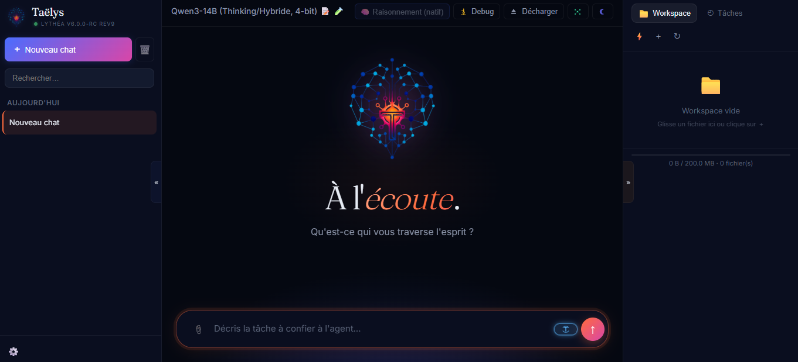

# Lythéa — IA cognitive locale & biomimétique

> Assistant LLM **100 % local** à mémoire neuro-inspirée, doté d'un agent observable
> (**Taëlys**), d'un contrôle d'activations (steering CAA) et d'une cascade optionnelle
> vers un modèle distant. Lythéa tourne *in-process* sur `transformers` — **pas de
> serveur d'inférence externe** — afin de garder un accès complet au flux résiduel du
> modèle (hooks, steering, latents de mémoire).


<p align="center">
  
</p>

<p align="center"><sub><em>L'interface de Taëlys en mode agent — splash « À l'écoute », sélecteur de modèle et panneau Workspace.</em></sub></p>

---

## Sommaire

- [Qu'est-ce que Lythéa ?](#quest-ce-que-lythéa-)
- [Pourquoi `transformers` et pas un serveur d'inférence ?](#pourquoi-transformers-et-pas-un-serveur-dinférence-)
- [Fonctionnalités phares](#fonctionnalités-phares)
- [Architecture](#architecture)
- [Prérequis](#prérequis)
- [Installation & déploiement](#installation--déploiement)
- [🔐 Accès & authentification (Cloudflare vs direct)](#-accès--authentification-cloudflare-vs-direct)
- [Modèles supportés (CATALOG)](#modèles-supportés-catalog)
- [🌀 Cascade Gemini (optionnelle)](#-cascade-gemini-optionnelle)
- [🎛️ Steering CAA](#️-steering-caa)
- [🤖 Agent Taëlys](#-agent-taëlys)
- [🩺 Surveillance](#-surveillance)
- [⚙️ Settings notables](#️-settings-notables)
- [🧪 Tests](#-tests)
- [⚠️ Limitations & avertissements](#️-limitations--avertissements)
- [📄 Licence](#-licence)

---

## Qu'est-ce que Lythéa ?

Lythéa est une **IA conversationnelle locale** construite autour d'une idée :
le pipeline cognitif (perception → mémoire → consolidation → génération) est
**agnostique au modèle**. On charge un LLM open-weights depuis Hugging Face,
et toute la machinerie cognitive vient se greffer autour, *à l'intérieur du
même processus Python*.

Concrètement, Lythéa apporte :

- un **cycle cognitif biomimétique** : chaque message traverse des phases
  ancrées en neuro-anatomie — encodage (cortex entorhinal), codage prédictif
  (Friston), surprise/saillance, métacognition (mPFC) et inhibition de sortie
  — au lieu d'un simple « prompt → réponse » ;
- une **mémoire biomimétique multi-étages** qui persiste et se consolide
  (au lieu d'un simple historique de tokens) ;
- un **agent observable**, *Taëlys*, qui décompose une mission en
  Thinker / Worker / Critic, exécute du code en bac à sable et coordonne
  son travail sur un *blackboard* ;
- un **steering CAA** (Contrastive Activation Addition) pour orienter le
  comportement du modèle en injectant des vecteurs directement dans le flux
  résiduel ;
- une **cascade optionnelle** vers un modèle distant (Gemini) qui rédige un
  brouillon que le modèle local resynthétise dans sa propre voix — le distant
  reste un simple *consultant*, jamais le cerveau ;
- un **catalogue de 23 modèles** couvrant cinq familles d'architecture
  (Instruct dense, Thinking, dual-mode, MoE, Liquid/SSM), de 3B à 32B.

Le tout est piloté depuis une **interface web** (FastAPI + JS vanilla,
streaming de tokens par WebSocket) servie via un tunnel Cloudflare.

---

## Pourquoi `transformers` et pas un serveur d'inférence ?

C'est une décision d'architecture **structurante**, pas un détail.

Des moteurs comme vLLM, TGI ou une API distante sont plus rapides, mais ils
exposent le modèle comme une boîte noire : on envoie des tokens, on reçoit
des tokens. Lythéa a besoin de **l'intérieur** du modèle :

- les **hooks** `register_forward_hook` sur les couches et la tête de
  langage, pour capturer le flux résiduel qui alimente la mémoire
  (MHN / KG) ;
- l'**injection de vecteurs de steering** dans les activations en cours de
  génération ;
- les **hidden states** complets (`output_hidden_states`) pour la
  consolidation.

Tout cela suppose un accès direct au graphe PyTorch. C'est pourquoi le
**cerveau de Lythéa reste toujours un modèle `transformers` local**. Les
modèles distants (via la cascade) ne peuvent intervenir qu'en *consultants* :
ils proposent un brouillon, mais c'est le modèle local qui parle et qui
mémorise.

---

## Fonctionnalités phares

### 🧠 Mémoire biomimétique (`lythea/memory/`)

Plusieurs systèmes de mémoire travaillent ensemble, inspirés de la
neuroscience :

| Système | Fichier | Rôle |
|---|---|---|
| **MHN** (Modern Hopfield Network) | `mhn.py` | rappel par énergie, motif → motif complet |
| **KG** (Knowledge Graph) | `kg.py` | entités & relations (accents, RapidFuzz, index trigrammes) |
| **Mémoire procédurale** | `procedural.py` | « comment faire » réutilisable |
| **Mémoire de travail visuelle** | `visual_working_memory.py` | tampon pour le contenu image |
| **État cognitif & saillance** | `cognitive_state.py`, `salience.py` | quoi retenir, quoi oublier |
| **Vectoriel** | (Chroma) | archivage long-terme sémantique |

La **consolidation** se fait par phases de *microsleep* et *deep sleep*
(ripples + replay), pas à chaque message.

### 🧬 Cycle cognitif (`lythea/cognition/`)

Le cœur de Lythéa. Chaque message traverse un **cycle cognitif** dont les
étapes sont câblées comme des *phases / hooks* (A → E) dans l'orchestrateur
`hippocampe.py`. Chaque module a un rôle précis et, le plus souvent, un
**ancrage neuro-anatomique** explicite. 25 modules, ~12 000 lignes.

**Le cycle de traitement**

| Étape | Module | Inspiration | Rôle |
|---|---|---|---|
| **Encodage** | `encoding.py` | cortex entorhinal | texte → représentations numériques (sparsification, *novelty gating*) ; ne stocke rien, *prépare* les signaux |
| **Prédiction** | `predictive_coding.py` | codage prédictif (Friston) | prédit l'embedding du prochain message (EMA) ; écart faible → *low-power* (réponse rapide, sans RAG), écart fort → force le RAG. **Désactivé par défaut** (`enable_predictive_coding` + `pc_apply_gating`) |
| **Écriture** | `storage.py` | hippocampe (CA3) | promotion d'entités au KG ; archivage des échanges (MHN + Chroma) |
| **Rappel** | `retrieval.py` | CA3, *pattern completion* | réassemble le contexte RAG par 3 voies parallèles : identité (KG) + MHN + Chroma |
| **Génération** | `generation.py` | — | nettoyage de sortie, prompt de raisonnement en deux passes |
| **Surprise** | `surprise.py` | ripples + dopamine (CA1) | surprise composite (4 signaux de nouveauté) + calibration du doute ; pilote la force d'écriture mémoire |
| **Métacognition** | `metacognition.py` | mPFC + cingulaire (dACC) | « suis-je en train de me tromper ? ma confiance est-elle calibrée ? » → étiquette de confiance, *hedging* |
| **Inhibition** | `inhibition.py` | contrôle inhibiteur | filtre de sortie en cascade à 3 niveaux (dernier rempart avant l'utilisateur) |
| **Consolidation** | `consolidation.py` | sommeil / *replay* | *microsleep* (ripples + replay + compression Chroma) et *deep sleep* (transfert vers le « néocortex ») ; persistance + sync git, hors des phases actives |

**Contrôle exécutif & raisonnement**

| Module | Inspiration | Rôle |
|---|---|---|
| `planning.py` | PFC latéral | contrôle exécutif : intention + pile de buts + générateur de plan ; contexte persistant sur plusieurs tours |
| `timeline.py` | — | extraction d'une chronologie narrative des échanges |
| `deep_reasoning.py` | — | chaîne de raisonnement profond multi-étapes (`DeepReasoningChain`) |
| `deliberation.py` | — | raisonnement délibératif multi-angles **pour les modèles non-*thinking*** (qui n'ont pas de `<think>` natif pour décomposer/confronter) |
| `reflection.py` | métacognition | boucle d'auto-critique **sélective**, déclenchée seulement sur les cas à risque |
| `auto_calibrator.py` | — | calibration par quantiles, indépendante du modèle |

**Routage & récupération avancée**

| Module | Rôle |
|---|---|
| `semantic_router.py` | choix d'outil multi-classes par embeddings (web, python, mcp…) — remplace l'ancienne décision binaire web/non-web |
| `tool_dispatcher.py` | *slow-path* : quand le routeur sémantique hésite (zone ambiguë), c'est le LLM qui tranche |
| `web_classifier.py` | décide « web ou non » via le LLM quand le *fast-path* par regex ne tranche pas |
| `crag.py` | *Corrective RAG* : évalue et classe les chunks récupérés au lieu de les écarter en silence |
| `graph_communities.py` | *GraphRAG* : détection de communautés thématiques sur le graphe de connaissances |
| `mcp_integration.py` | choisit l'outil MCP à invoquer (lecture/écriture de fichier, listing…) quand la route `mcp` est retenue |

La **perception visuelle** (`vision_semantic.py`, `vision_active.py`) et la
**cascade Gemini** (`cascade.py`) appartiennent aussi à `cognition/` ; elles
ont leur propre section ci-dessous.

### 🤖 Agent Taëlys (`lythea/agentic/`)

Un agent **ReAct observable** : chaque étape de raisonnement, chaque appel
d'outil et chaque vérification sont visibles dans l'UI.

- `orchestrator.py` — pilote la mission, boucle ReAct
- `workers.py` / `verifier.py` — rôles **Thinker / Worker / Critic**
- `router.py` — routage par compétence (code / analyse / …)
- `blackboard.py` — tableau noir partagé entre étapes
- `skills.py` — bibliothèque de *skills* que l'agent peut acquérir et rejouer
- `sandbox.py` + `lythea/tools/python_executor.py` — exécution de code isolée
- `blockage.py` / `progress.py` / `mission_memory.py` — détection d'impasse,
  suivi d'avancement, mémoire de mission

### 🎛️ Steering CAA (`lythea/steering/`)

Contrôle du comportement du modèle par **injection de vecteurs** (Contrastive
Activation Addition) dans le flux résiduel, via des hooks PyTorch.

- `axes.py` — axes de comportement (p. ex. concision, prudence…)
- `vectors.py` — calcul/stockage des vecteurs contrastifs
- `engine.py` — injection à l'inférence

### 🌀 Cascade Gemini (`lythea/external/` + `lythea/cognition/cascade.py`)

Pipeline *draft-then-refine* optionnel : Gemini Flash rédige un brouillon
riche, le modèle local le **resynthétise dans la voix de Taëlys** et fournit
les latents qui alimentent la mémoire. Désactivée par défaut, jamais
bloquante (fallback local transparent). Voir [la section dédiée](#-cascade-gemini-optionnelle).

### 🌐 Recherche web & MCP

- `lythea/web_providers/` — recherche web **multi-fournisseurs** :
  Brave, DuckDuckGo, SearXNG, Serper, Tavily (sélection par `factory.py`).
- `lythea/mcp/` — support **Model Context Protocol** (client, gestion de
  serveurs, prérequis).

### 👁️ Vision active — « zoom cognitif » (`lythea/cognition/vision_semantic.py`)

Face à une image (modèle multimodal/VLM), Lythéa ne se limite pas à une
description globale : elle peut **re-focaliser le modèle sur une région précise**
de l'image — comme un regard qui se rapproche d'un détail.

- **Déclenchement sémantique et multilingue.** Plutôt que de guetter des
  mots-clés (« zoom sur… », « que dit le panneau ? »), le système compare
  l'intention de ton message à des *prototypes d'intentions* par similarité
  d'embeddings (50+ langues, robuste aux paraphrases et aux fautes de frappe).
- **Re-lecture ciblée.** Quand le besoin est détecté, un prompt focalisé fait
  ré-examiner **la zone** par le VLM, et l'observation est réinjectée dans le
  contexte (badge « 🔍 Zoom cognitif sur : … »).
- **Mémoire et suggestion.** Chaque zoom est enregistré dans la mémoire de
  travail visuelle, et Lythéa peut **proposer un zoom** au tour suivant.
- **Garde-fou anti-hallucination.** Lorsqu'une image est présente mais
  qu'aucun zoom n'est demandé, un filet évite que le modèle invente des détails.

Bénéfice : plus de précision sur les détails fins (texte dans l'image, petits
objets) et nettement moins d'hallucinations qu'une description « en un coup ».

---

## Architecture

```
lythea/
├── cognition/        # pipeline cognitif (26 modules) : encoding, storage,
│                     #   surprise, retrieval, consolidation, generation, cascade…
├── memory/           # mémoire biomimétique : MHN, KG, procédurale,
│                     #   working memory, état cognitif, saillance
├── agentic/          # agent Taëlys : orchestrator, workers, verifier, router,
│                     #   blackboard, skills, sandbox, blockage, progress
├── steering/         # steering CAA : axes, vectors, engine (hooks)
├── external/         # clients distants (cascade) : gemini_client
├── web_providers/    # recherche web : brave, ddg, searxng, serper, tavily
├── mcp/              # support Model Context Protocol
├── tools/            # exécuteur Python sandboxé
└── server/           # FastAPI : routes, statiques (index.html + app.js), WS
```

**Volume** : ~97 modules Python, ~42 000 lignes. Le package `cognition/`
(26 modules) concentre le pipeline perception → mémoire → génération ;
l'API publique de `hippocampe.py` (l'orchestrateur cognitif) est stable.

**Flux d'un message** (simplifié) : encodage en latents + extraction
d'entités → calcul de saillance/surprise → écriture mémoire (KG, archivage
MHN/Chroma) → récupération du contexte (identité KG + RAG) → génération locale
(ou cascade) → consolidation différée.

---

## Prérequis

- **GPU NVIDIA CUDA** avec ~**24–40 GB de VRAM** selon le modèle chargé
  (un 14B en bf16 ou un 32B en NF4 tiennent confortablement sur 24–40 GB ;
  voir le [CATALOG](#modèles-supportés-catalog)).
- **Python 3.11+**
- **PyTorch 2.8 (cu128)** et **Transformers** récents (installés par `deploy.sh`).
- Environnement type **RunPod** / serveur GPU Linux. Lythéa expose un tunnel
  Cloudflare, donc aucune ouverture de port n'est nécessaire.

> Lythéa charge les poids en **4-bit (NF4) via bitsandbytes** par défaut pour
> les gros modèles. Le `compute_dtype` est **bf16** sur CUDA (choix délibéré :
> fp16 provoquait des NaN sur certaines architectures).

---

## Installation & déploiement

```bash
git clone https://github.com/Benoth08/Lythea-Reasoning-Agent.git
cd Lythea-Reasoning-Agent

bash deploy.sh     # installe torch, transformers, bitsandbytes + deps,
                   #   et génère le token d'authentification

bash launch.sh     # démarre le serveur (port 7860) + tunnel Cloudflare ;
                   #   l'URL https://...trycloudflare.com est imprimée
```

Lance `launch.sh` dans un **terminal** (pas dans un notebook) : il garde le
processus serveur au premier plan et affiche les logs de boot.

**Dépannage** — si le lancement échoue sur une erreur liée à `typer`,
forcer une version compatible avant de relancer :

```bash
pip install --break-system-packages --ignore-installed --no-deps typer==0.26.7
```

Après une modification de l'UI (`index.html` / `app.js`), faire un
**rechargement forcé** du navigateur (Ctrl+Shift+R). Après un changement de
modèle dans `config.py`, **recharger le modèle** depuis l'interface.

---

## 🔐 Accès & authentification (Cloudflare vs direct)

Il y a **deux couches indépendantes** : *comment tu atteins le serveur*
(l'exposition) et *comment tu prouves que tu as le droit d'entrer* (le token).

### Le token d'authentification

`deploy.sh` génère un `LYTHEA_AUTH_TOKEN` aléatoire (32 octets, 64 caractères
hex) et l'écrit dans `.env`. Il te l'affiche **à la fin du déploiement** :

```
🔐 Token d'auth (à saisir au 1er accès web) :
   3f9a8c2e…<64 caractères hex>
```

Tu peux le relire à tout moment :

```bash
grep LYTHEA_AUTH_TOKEN .env
```

Au premier accès **via une URL publique**, l'interface te demande ce token :
colle-le, il est mémorisé dans ton navigateur (`localStorage`) et renvoyé
ensuite automatiquement (en-tête `Authorization: Bearer …`). Un bouton
**« 🔐 Réinitialiser le token »** dans les réglages permet de l'oublier et de
le re-saisir.

### Deux façons d'accéder

| Méthode | URL | Token requis ? |
|---|---|---|
| **A. Tunnel Cloudflare** (défaut) | `https://xxx.trycloudflare.com` (change à chaque lancement) | ✅ **Oui** — colle le token au 1er accès |
| **B. Accès direct / loopback** | `http://localhost:7860` (ou tunnel SSH) | ❌ **Non** — bypass automatique |

Le serveur applique cette règle **tout seul** : il détecte les en-têtes que
Cloudflare ajoute (`cf-connecting-ip`…). Requête arrivée par le tunnel →
token exigé (l'URL est publique). Requête en loopback direct → token bypassé
(l'accès au pod fait déjà barrière). Pour exiger le token **même en
loopback**, mets `LYTHEA_AUTH_STRICT=true` dans `.env`.

#### A. Avec Cloudflare (le défaut)

`launch.sh` lance `cloudflared` et imprime les deux URLs :

```
🔗 Tunnel : https://abcd-efgh.trycloudflare.com
🔗 Local  : http://localhost:7860
```

Ouvre l'URL **Tunnel** dans ton navigateur → colle le token d'auth quand l'UI
le demande. ⚠️ Cette URL est **publique** : quiconque la connaît peut tenter
d'y accéder — le token est ta seule protection, ne la diffuse pas à la légère.

#### B. Sans Cloudflare (accès direct)

- **Sur le pod** (terminal de la machine GPU) : `http://localhost:7860`, sans token.
- **Depuis ta machine**, via un tunnel SSH (URL stable, privée, sans token) :
  ```bash
  ssh -L 7860:localhost:7860 root@<ip-du-pod>
  # puis, dans le navigateur : http://localhost:7860
  ```
- **Via le proxy RunPod**, si tu as exposé le port 7860 à la **création** du
  pod : `https://<pod-id>-7860.proxy.runpod.net`. ⚠️ URL publique elle aussi →
  garde le token actif (`LYTHEA_AUTH_STRICT=true`).

### Pourquoi Cloudflare par défaut ?

Le tunnel SSH et le proxy RunPod fonctionnent, mais Cloudflare a trois
avantages décisifs pour des pods éphémères :

1. **Zéro configuration réseau.** Le tunnel est **sortant** : c'est le pod qui
   appelle Cloudflare, donc aucun port entrant à ouvrir et **rien à déclarer à
   la création du pod**. Si tu as oublié d'exposer le port 7860 sur RunPod (le
   cas le plus fréquent), Cloudflare te sauve — le proxy RunPod, lui, exige que
   le port ait été déclaré dès le départ.
2. **HTTPS valide d'office.** Certificat TLS automatique, sans avertissement
   navigateur — **indispensable au WebSocket sécurisé** du streaming de tokens.
3. **Portable.** Marche à l'identique sur RunPod, Vast.ai, Lambda ou une
   machine perso derrière un NAT. Le proxy RunPod est spécifique à RunPod.

**Le compromis :** l'URL `trycloudflare` **change à chaque `launch.sh`** (le
mode gratuit ne donne pas de sous-domaine stable) et elle est **publique** —
d'où le token d'auth obligatoire sur ce chemin. Si tu veux une URL **stable et
privée**, le **tunnel SSH** (méthode B) est le meilleur complément.

---

## Modèles supportés (CATALOG)

Le catalogue (`lythea/config.py`) contient **23 modèles** répartis en cinq
familles d'architecture. Chaque entrée porte sa taille (empreinte NF4), son
profil de raisonnement et un **profil de sampling** appliqué automatiquement
au chargement.

> Le modèle chargé **au boot** est défini par `DEFAULT_MODEL` dans
> `config.py` (un petit Instruct par défaut, pour démarrer vite). On change
> de modèle à chaud depuis l'UI — le catalogue va jusqu'à **Qwen3-32B** (NF4,
> ~18 GB).

Familles couvertes :

| Famille | Exemples | Particularité |
|---|---|---|
| **Instruct dense** | Qwen2.5 (3B/7B), Phi-4-mini | génération directe |
| **Thinking** | Qwen3 (4B/8B/14B/32B), DeepSeek-R1 distills | `<think>` natif (chaîne de raisonnement) |
| **Dual-mode** | SmolLM3-3B | raisonnement activable via toggle UI |
| **MoE** | Qwen1.5-MoE-A2.7B | experts clairsemés (compute ≪ mémoire) |
| **Liquid / SSM** | LiquidAI LFM2 | architecture non-Transformer (CfC) |

**Astuce VRAM** : sur ≥ 32 GB, recharger un Qwen3-14B en **bf16 plein**
(plutôt qu'en NF4) donne un **gain de vitesse** et une meilleure qualité
qu'un 32B en NF4 — souvent le meilleur compromis.

**Profils de sampling** : au chargement d'un modèle, les six sliders de
l'onglet *⚙️ → Génération* se calent sur les valeurs recommandées de sa model
card (température, top_p, top_k, min_p, etc.). On peut override en runtime
(`POST /api/config/sampling`) ; l'override est perdu au prochain chargement
(le profil du nouveau modèle prime — KISS).

---

## 🌀 Cascade Gemini (optionnelle)

Pipeline **draft-then-refine** : Gemini Flash produit un brouillon riche, et
le **modèle local le synthétise** en quelques phrases dans la voix de Taëlys,
tout en fournissant les latents qui alimentent MHN / KG.

### Pourquoi pas Gemini seul ?

1. Les hooks de mémoire sont sur le modèle **local** : si Gemini parlait
   directement, la mémoire et la consolidation ne verraient rien.
2. Lythéa a une **voix distinctive** (concise, sobre, FR) qu'on ne veut pas
   voir écrasée par le style du modèle distant.
3. Le modèle local sert de **filet de sécurité** : en cas de timeout, de
   quota dépassé ou de clé invalide, **fallback transparent** vers le pipeline
   100 % local — aucune erreur visible.

### Activation

Deux manières, au choix :

**A. Dans l'interface (recommandé).** Panneau *Cascade* → coller la clé Google
AI Studio (`AIzaSy…`) dans le champ → **Enregistrer**. La clé est stockée
**en mémoire vive uniquement** (jamais écrite sur disque, masquée à
l'affichage, perdue au redémarrage). Champ vide + Enregistrer = retour au
`.env`.

**B. Via `.env`** (persistant) :

```bash
GOOGLE_API_KEY=AIzaSy...        # clé Google AI Studio
LYTHEA_ENABLE_CASCADE=true
```

Modèle par défaut : **`gemini-3.5-flash`** — le meilleur du *free tier*
(qualité élevée, agentique, contexte 1M ; ~1500 requêtes/jour sans carte
bancaire). Modèle configurable via `LYTHEA_CASCADE_GEMINI_MODEL` (p. ex.
`gemini-3.1-flash-lite`, plus rapide). Activation à chaud aussi possible via
`POST /api/config/cascade/toggle`.

### Comportement opérationnel

| Situation | Résultat |
|---|---|
| Cascade off (défaut) | Pipeline 100 % local |
| Cascade on, brouillon court | Brouillon Gemini livré tel quel |
| Cascade on, brouillon long | Synthèse locale dans le ton Taëlys |
| Quota dépassé / réseau down | Fallback local (retry exponentiel d'abord) |
| Clé invalide | Fallback local, warning au boot |

### Coût & confidentialité

- **Gratuit** jusqu'au quota du free tier sur les modèles Flash.
- ⚠️ **En free tier, Google peut utiliser tes conversations** pour améliorer
  ses produits. Pour des données sensibles, activer la facturation (la clé
  reste la même, seul le *flag billing* change) — ou rester **100 % local**
  en laissant la cascade désactivée (défaut).

---

## 🎛️ Steering CAA

Le steering permet d'**orienter le comportement** du modèle sans le
ré-entraîner, en ajoutant un vecteur de direction à ses activations pendant
la génération (Contrastive Activation Addition).

- On définit des **axes** contrastifs (paires d'exemples « + » / « − »).
- On en dérive des **vecteurs** par différence de moyennes d'activations.
- Le **moteur** injecte ce vecteur (avec un coefficient réglable) via des
  hooks, couche par couche.

> Composant **expérimental** et fortement lié à l'architecture du modèle
> chargé. À recalibrer par modèle.

---

## 🤖 Agent Taëlys

Taëlys est l'agent de Lythéa : il prend une **mission** et la mène en boucle
**ReAct observable**, en assignant des rôles à chaque tour
(**Thinker / Worker / Critic**) et en exécutant du code en bac à sable.

Pilotage par API :

```bash
# 1) ouvrir une session
curl -X POST .../api/sessions -d '{}'           # → { "session_id": "..." }

# 2) lancer une mission
curl -X POST .../api/agent/run \
  -d '{"task": "Écris une fonction est_premier(n) avec ses tests, et fais-les passer.",
       "session_id": "<SID>", "react": true}'
```

Chaque mission est isolée par session : lancer une nouvelle mission dans une
autre discussion **ne perturbe pas** une mission en cours ailleurs.

---

## 🩺 Surveillance

| Endpoint | Description |
|---|---|
| `GET /api/boot/status` | progression du boot |
| `GET /api/health` | état général |
| `GET /api/memory/status` | compteurs MHN / KG / Chroma |
| `GET /api/memory/kg/entities` | entités KG (`last_seen`, mentions, confiance) |
| `GET /api/cache/stats` | hit rate des caches |
| `GET /api/config/cascade` | état de la cascade (clé **toujours masquée**) |

---

## ⚙️ Settings notables

Configuration via variables d'environnement (préfixe `LYTHEA_`), documentées
dans `.env.example`.

| Variable | Défaut | Notes |
|---|---|---|
| `LYTHEA_ENABLE_CASCADE` | `false` | active la cascade Gemini |
| `GOOGLE_API_KEY` | — | clé AI Studio (sans préfixe `LYTHEA_`) |
| `LYTHEA_CASCADE_GEMINI_MODEL` | `gemini-3.5-flash` | modèle distant du brouillon |
| `LYTHEA_CROSS_ENCODER_MIN_SCORE` | `0.2` | seuil de rerank (calibré empiriquement) |
| `LYTHEA_ENTROPY_THRESHOLD` | `0.2` | gradient fait / intuition / hypothèse |
| `LYTHEA_COREFERENCE_WINDOW_SEC` | `1800` | fenêtre du fallback « Je » → KG |

---

## 🧪 Tests

La suite couvre **66 fichiers de tests**. Un sous-ensemble de **166 tests
s'exécute sans GPU** (logique agentique, outils, routeur, blackboard,
steering, skills, sandbox, verifier, ingestion…) — pratique en CI ou sur
machine sans carte :

```bash
pip install -q pytest pydantic pydantic-settings
python -m pytest tests/test_tools.py tests/test_agentic.py tests/test_codegen.py \
  tests/test_router.py tests/test_blackboard.py tests/test_progress.py \
  tests/test_steering.py tests/test_skills.py tests/test_sandbox.py \
  tests/test_verifier.py tests/test_ingest.py tests/test_blockage.py -q
# → 166 passed
```

Les tests restants nécessitent un modèle chargé (chemin GPU) et tournent sur
le pod.

---

## ⚠️ Limitations & avertissements

Lythéa est un **projet de recherche personnel**, pas un produit clé en main.
En toute honnêteté :

- **Pas de garantie de production** : pas de SLA, l'API et le schéma de
  données peuvent changer entre versions.
- **Dépendant du matériel** : pensé pour un GPU CUDA avec assez de VRAM. Les
  petits modèles tournent sur 24 GB ; viser un 32B impose le 4-bit.
- **Certains modèles du CATALOG sont expérimentaux** (p. ex. les modèles
  multimodaux ou à tokenizer non-standard) : le chargement, les hooks et le
  steering sont **à valider au premier chargement**, pas garantis.
- **Steering & mémoire** sont des composants de recherche : leur calibrage
  dépend du modèle et demande de l'ajustement.
- **Cascade = données distantes** : dès qu'elle est activée, les prompts
  partent chez Google (et, en free tier, peuvent servir à l'entraînement).
  Pour rester privé : cascade désactivée (mode par défaut).
- **Qualité ≠ vitesse** : un gros modèle dense en 4-bit est *lent* (lié à la
  bande passante mémoire). Couper les tokens de *thinking* et privilégier un
  14B en bf16 sont les principaux leviers de réactivité.

---

## 📄 Licence

Distribué sous licence **MIT** — voir le fichier [`LICENSE`](LICENSE).

Copyright (c) 2026 Michaël Féré.

Lythéa s'appuie sur de nombreux projets open-source (PyTorch, Hugging Face
Transformers, bitsandbytes, FastAPI, ChromaDB, et les modèles open-weights de
leurs éditeurs respectifs), chacun sous sa propre licence.
